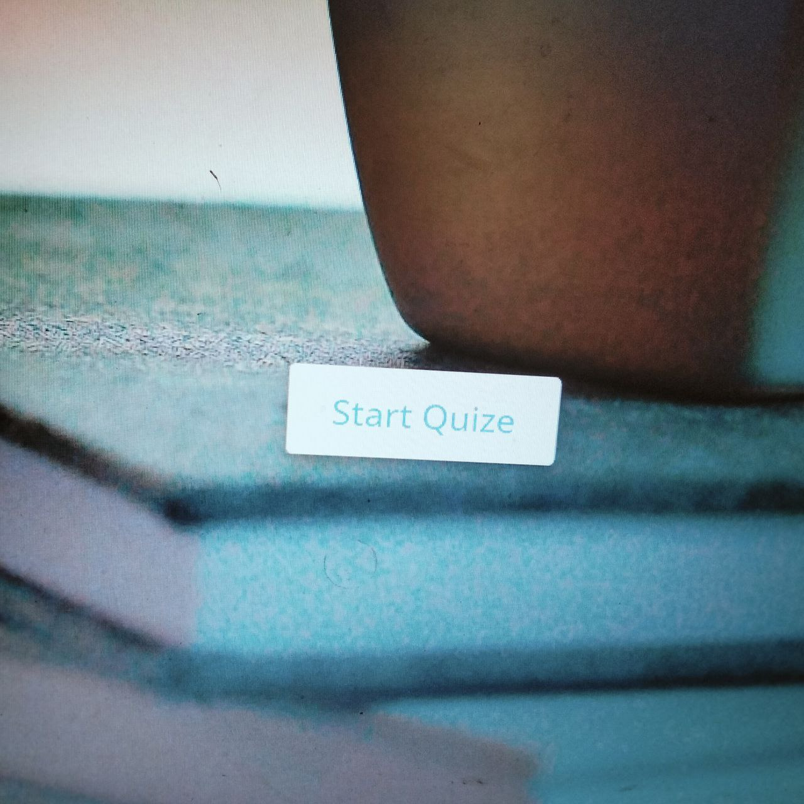
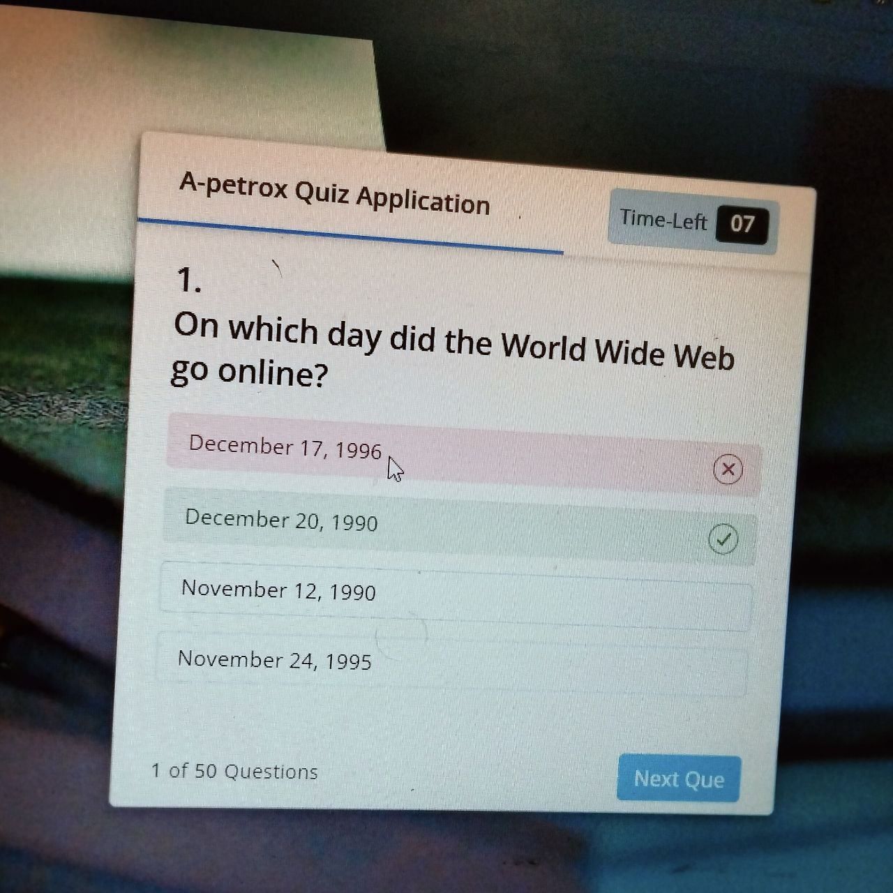
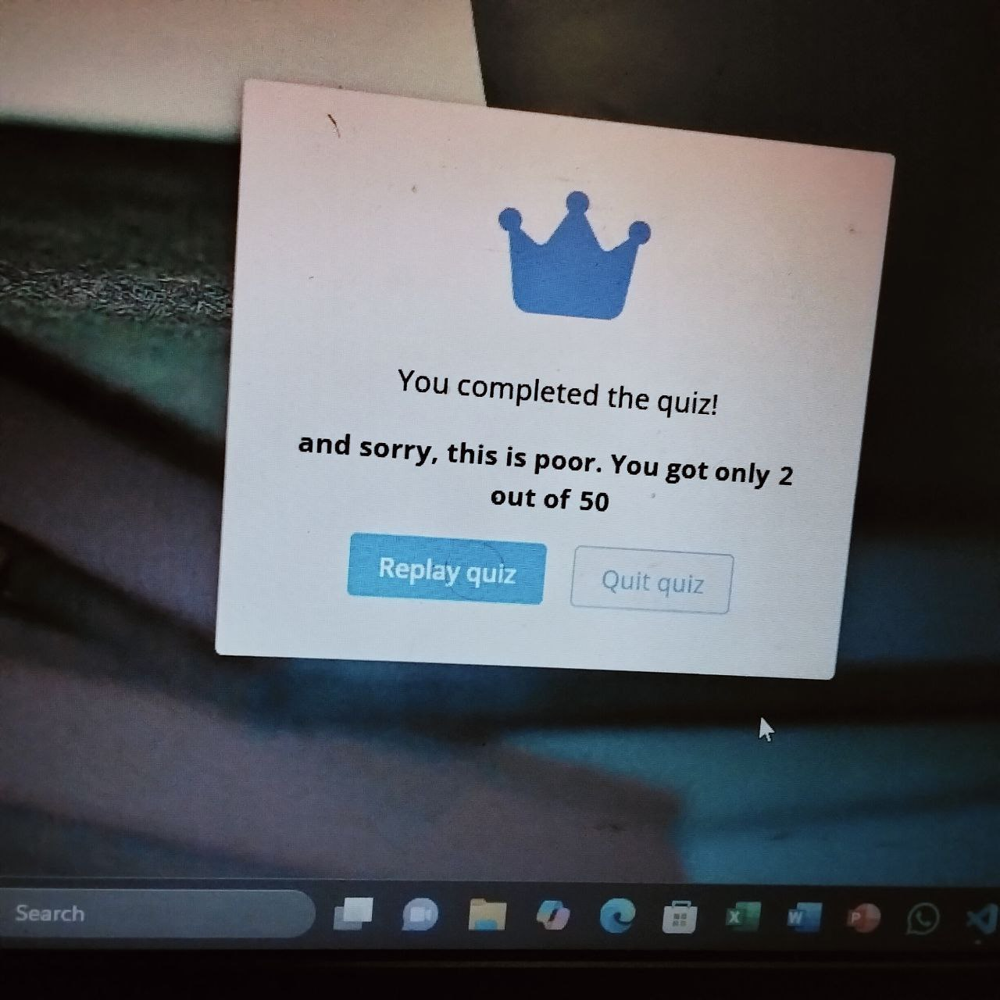

# 🧠 Web Quiz App

A fun and interactive quiz web application built with **HTML**, **CSS**, and **JavaScript**. This app challenges users with multiple-choice questions based on web development topics like JavaScript, HTML, CSS, and more.

---

## 🚀 Features

- 📚 50 multiple-choice questions
- 🧪 Covers HTML, CSS, JavaScript, and Web APIs
- 🔄 Randomized questions with shuffled options
- ⏱️ Optional timer mode
- ✅ Instant feedback on selected answers
- 📊 Score tracking
- 💻 Responsive design for all screen sizes

---

## 📸 Screenshots

> Add some images/gifs of your app here if possible. Example:

---

## 🛠️ Tech Stack

- **HTML5** – for markup structure
- **CSS3** – for layout and styling
- **JavaScript (ES6+)** – for app logic, interactivity, and DOM manipulation
